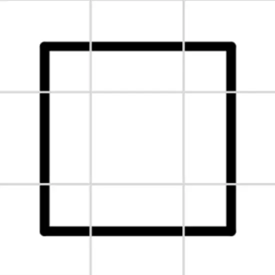

# Line sim 3d

A simulation to model a line following robot

Check out the [Demo](https://omareq.github.io/line-sim-3d/).

Check out the [Docs](https://omareq.github.io/line-sim-3d/docs/).

Created using [p5.js](https://p5js.org/)

## Todo

- [ ] render in 2d and 3d

- [x] show and hide grid lines

- [x] add simulation modes including debug views

    - [x] single tile unmoving digital/analogue LS at mouse pos variable size

    - [x] single tile moving digital/analogue LS at mouse pos

    - [x] room of tiles digital/analogue LS at mouse pos

    - [x] room of tiles with LS array

## Example Room Json

The map editor offers the capability to design a specific room to test the
capability of a particular line following algorithm.  These rooms can be saved
in json form and reloaded when required and multiple algorithms can be run on
the same room.  An example of a very basic room can be seen in the code block
below.

```js
{
  "name": "Room-Example-3x3-Loop",
  "xNumTiles": 3,
  "yNumTiles": 3,
  "showGrid": true,
  "grid": [
    [
      "cornerDownRight",
      "verticalLine",
      "cornerUpRight"
    ],
    [
      "horizontalLine",
      "blankLine",
      "horizontalLine"
    ],
    [
      "cornerDownLeft",
      "verticalLine",
      "cornerUpLeft"
    ]
  ]
}
```




## Contact Details
__Programmer:__ Omar Essilfie-Quaye (omareq08+githubio@gmail.com)


(This is an auto-generated document, not all links will necessarily work)
